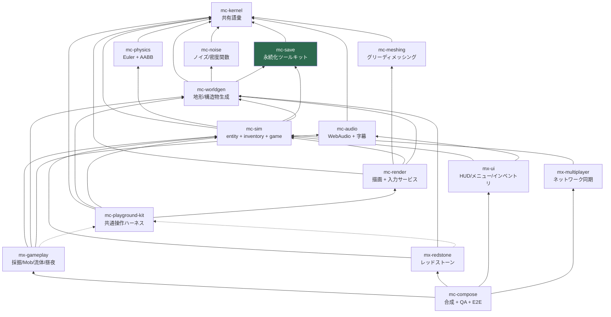
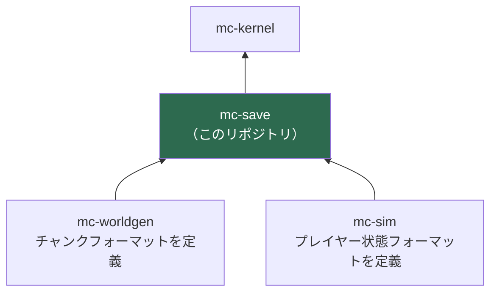

# アーキテクチャ

## 1. 4 階層

plan.md §2.2 の 4 階層。**性質が違うものを同じ階層に置かない**ことが唯一の規律である。

| 階層 | リポジトリ | 性質 |
| --- | --- | --- |
| 安定ライブラリ | kernel / noise / meshing / physics / **save** / audio | 純粋関数・狭い界面・変更頻度が低い。相互独立で並行構築できる |
| 基盤 | worldgen / sim / render / playground-kit | 状態とサービス（**名詞**）。体験モジュールが乗る土台 |
| 体験モジュール | mx-gameplay / mx-redstone / mx-ui / mx-multiplayer | ルールと UI（**動詞**）。互いを知らず、基盤サービス経由でのみ会話する |
| 合成 | mc-compose | Layer マージ + stage 順序表 + E2E。ロジックを持たない |

階層外に `mc-dev-meta`（plan.md §6 Step 0 の開発用 workspace）がある。
これは他リポジトリを clone するだけで、依存はしない。

## 2. 依存グラフ（16 リポジトリ全体）

実線 = 実行時依存 (`dependencies`)、点線 = プレビュー起動時のみ (`devDependencies`)。



このグラフは `scripts/check-dependency-whitelist.ts` の `REPOSITORY_POLICY.dependencyGraph`
に**そのまま**記述されており、CI で機械的に強制される。
図とコードが食い違ったらコードが正である（図のほうを直すこと）。

### 強制されるルール

| ルール | 内容 |
| --- | --- |
| ハード失敗 | 違反があれば CI は非ゼロ終了する。警告で済ませない |
| 循環禁止 | 例外リスト（「co-evolution ペア」等）を設けない |
| **推移閉包の禁止** | A→B、B→C のとき A は C を import できない。依存は直接依存のみが import 許可を意味する |
| kernel は例外 | mc-kernel はどこからでも import 可（ただし `package.json` への記載は必要） |
| 宣言と実体の一致 | import する `@nerima-games/*` は `package.json` に無ければ違反 |
| kit は devDependency 専用 | `dependencies` に入れたら CI fail |
| `Date.now()` 禁止 | 時刻は注入された Clock Port から取得する |

## 3. mc-save の位置

**安定ライブラリ階層（tier 1）のリーフ。**

- **親（mc-save が依存してよいもの）**: `mc-kernel` のみ。
  ホワイトリスト上の直接依存は**空集合**である。
- **子（mc-save に依存するもの）**: `mc-worldgen`、`mc-sim`。
  この 2 つがチャンク／プレイヤー状態のフォーマットを mc-save のツールキットで**自分で定義する**。



### 依存の向きが逆転していないことの確認

mc-save が `mc-worldgen` を import したくなったら、それは**設計が壊れた合図**である。
チャンクの永続化フォーマットは worldgen が `defineFormat` で定義するものであって、
mc-save が「チャンクとは何か」を知る必要はない。

参照実装はこの逆転を起こしていた。ストレージサービスがチャンクとワールドメタデータを
名指しで知っており（`packages/world/infrastructure/storage-service.ts:96-139` の
`saveChunk` / `loadChunk` / `saveWorldMetadata` / `loadWorldMetadata`）、
そのために永続化と世界生成が同じパッケージから出られなくなっていた。

## 4. 構成ルール（plan.md §2.3）

### 4-1. 基盤 = 名詞、体験 = 動詞

`InventoryService` のような**状態の置き場**は基盤階層に置く。
「掘ったらドロップする」という**ルール**は体験階層に置く。
体験モジュール間の依存エッジはゼロであり、
「採掘 → インベントリに入る」は sim の `InventoryService` を経由して実現する。

mc-save は名詞ですらなく、その下の道具（**動詞も名詞も持たない純粋な機構**）である。
「いつ保存するか」は mc-save の関心ではない。自動保存のスケジュールは sim / compose が持つ。

### 4-2. mc-playground-kit は devDependency 専用

kit は「ミニ世界 + カメラ + レンダラ + 入力を 1 秒で束ねる糊」であり、プレビュー専用である。
実行時入力サービスを所有するのは **mc-render** であって kit ではない。

kit を `dependencies` に入れると、出荷ビルドから入力処理が消える。
これは `scripts/check-dependency-whitelist.ts` が
`dev-only-package-in-dependencies` として**必ず失敗**させる。
mc-save は kit を devDependency としても使わない（プレビューを持たないため）。

### 4-3. stage 実行順序表は mc-compose が唯一所有する

各モジュールは `StageRegistration.after` で**順序制約を宣言するだけ**であり、
全順序 (total order) を解決するのは compose だけである。
どのリポジトリも「自分は 3 番目に走る」と書いてはならない。

標準の骨格（plan.md §4.2）:

```
input → simulation(physics → interactions → entities → fluids → redstone → time/weather)
      → camera-mirror → chunk-sync → render → post-fx → hud-sync
```

mc-save は frame stage を一切登録しない。永続化は stage ではなく、
`forkDaemon` された自動保存ループ（sim が所有）から呼ばれる。

## 5. なぜ 16 に分けたのか

単一リポジトリ (84k LOC) では「正しく動くことが保証される単位」が大きすぎ、
検証しきれなかった。分割の目的は**体験単位ごとに正しさを単独で閉じる**ことであり、
そのためにリポジトリは「テスト green + プレビューで目視確認済み」で完結する。

mc-save にプレビューは無い（UI を持たないため）。
代わりに**ラウンドトリップとマイグレーションのテストが完了条件**になる。
詳細は [testing.md](./testing.md)。
